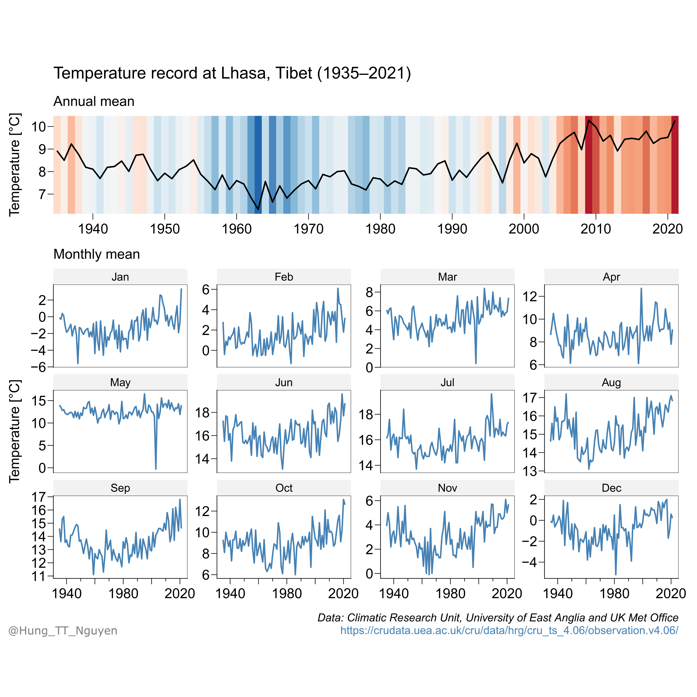

We propose new reconstructions of past temperatures and precipitations on the Tibetan Plateau. Combining our new reconstructions with existing records, we seek to explore the role of climate in driving past changes in demographic patterns. 

We have submitted a proposal to the NSF HEGS Program and results are pending.

We have also received USD 2,500 from the Department of East Asian Languages and Culture, Columbia University, to develop the course <i>**A Climate History of the Tibetan Plateau**</i>.

Tibet has been warming significantly over the past decades. This project will place recent warming in a long-term context.

More soon.