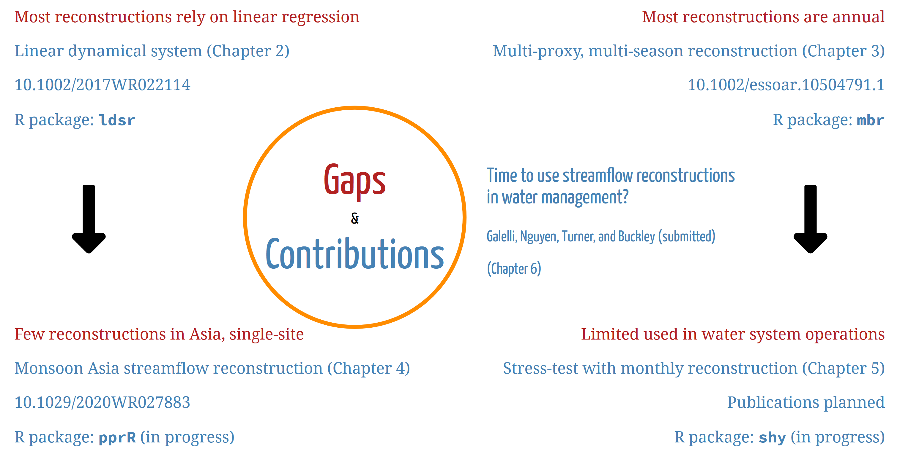

```{r setup, include=FALSE}
knitr::opts_chunk$set(echo = FALSE)
```

# Overview

I study variability and changes in the water cycle across spatiotemporal scales, and apply this knowledge to water resources management.

The [Publications](publications.html) page lays out where each work is placed within this overarching goal.

My PhD thesis mainly focuses on past variability via streamflow reconstructions. As side projects, which are fun and interesting, I have also studied the impacts of modern days' climate variability on water and energy systems. In my postdoc I plan to incorporate future changes.

# PhD thesis

Here is my PhD thesis on a page. I identify four knowledge gaps in dendrohydrology and water management, and built new methods and applications to address them. For each work I also publish an R package and a public data repo. If you have similar research interests, please reach out.

```{r, fig.width=15, fig.height=8.5, layout='l-body-outset'}

```

::: {style="text-align:center"}
*A one-pager of my PhD thesis. View my defense talk [here](https://www.dropbox.com/s/ud9npy1fdw66j3o/Hung%27s%20PhD%20defense.mp4?dl=0).*
:::

## Linear dynamical system reconstruction

Most reconstruction methods rely on linear regression, which does not account for catchment dynamics. To tackle this, I develop a novel streamflow reconstruction framework based on linear dynamical systems (LDS). The unique feature of this framework, compared to conventional reconstruction techniques, is the inclusion of a hidden state variable---the catchment flow regime (i.e., wet or dry). The LDS model also serves as a stochastic streamflow generator. Using the LDS model, we reconstruct streamflow for the Ping River (Thailand), unravelling four centuries of regime shifts in the catchment.

[Paper](https://agupubs.onlinelibrary.wiley.com/doi/full/10.1002/2017WR022114) \| [R package](https://github.com/ntthung/ldsr) \| [Code repo](https://github.com/ntthung/Ping) \| [Talk](assets/LDSEM_CCRS_2018_01_18.pptx)

## Monsoon Asia streamflow reconstruction

Few reconstructions have been done in Asia, all of which are single-sited; a regional, synthesized understanding is lacking. I apply the LDS model to reconstruct streamflow at 62 stations on 41 rivers in 16 countries across the Asian Monsoon region---the *Monsoon Asia*. For such a large scale reconstruction, it is impractical to manually tune the model hyperparameters (the thresholds to include paleoclimate proxies) as I did in the LDS work. Therefore, I also develop a novel, automatic, and climate-informed input selection scheme. This large scale reconstruction reveal that streamflow in Monsoon Asia is spatially coherent, owing to common influences exerted by the oceans. The reconstruction also shows how these oceanic teleconnections vary over space and time.

[Paper](https://agupubs.onlinelibrary.wiley.com/doi/abs/10.1029/2020WR027883) \| [Code repo](https://github.com/ntthung/paleo-asia) \| [Media](https://wiley.altmetric.com/details/91444995/news)

## Mass balanced sub-annual reconstruction

In this project, I address a fundamental challenge in streamflow reconstruction: tree ring data are annual, so how do we obtain sub-annual (e.g., seasonal or monthly) reconstructions that are more practically useful for water resources management? Leveraging the fact that different tree ring proxies are sensitive to different seasons, I develop a novel framework that optimizes proxy combination in order to obtain seasonal reconstructions together with the annual one. Importantly, the framework ensures that the total seasonal flows match the annual flow closely. This mass balance criterion is important for water resources decisions such as water allocation.

[Preprint](https://www.essoar.org/doi/10.1002/essoar.10504791.1) \| [R package](https://github.com/ntthung/mbr) \| [Code repo](https://github.com/ntthung/multiproxy-mbr) \| [EGU talk](https://www.dropbox.com/s/rloje2brbyn0isx/agu-2020-%20PP033-05-hung.mp4?dl=0)

## Stress-testing water system with paleodata

I first expand the mass-balance-adjusted regression to obtain monthly reconstructions---a six-fold increase in temporal resolution. Then, I use the reconstructions to train a stochastic streamflow generator in order to simulate and probabilistically assess the performance of Thailand's main water resources system. The simulations produce difference performance distributions with different stochastic ensembles, suggesting that using instrumental data alone may not be adequate. This work demonstrates that, thanks to monthly reconstruction, it is now feasible to use reconstructed streamflow in operational studies of water system. The results also point out important challenges that remain to be solved so that streamflow reconstructions can be used for optimizing water system operations.

# PhD side projects

I took on these side projects for fun as the research questions fascinated me. They turned out to be more than just side projects---they helped shape my overall research goal!

## ENSO-informed reservoir operations

*Led by Dr. Christoph Libisch-Lehner. This work was a part of his PhD thesis.*

Using the Angat Reservoir (the Philippines) as a case study, we show that traditional policies that are based on storage and inflow are less robust than ENSO-informed policies.

[Paper](https://agupubs.onlinelibrary.wiley.com/doi/full/10.1029/2018WR023622)

## The climate-water-energy nexus of the Greater Mekong Subregion

*Led by Dr. Stefano Galelli. This is a joint work of members of the Resilient Water System group.*

The Greater Mekong Subregion is a huge population center, thirsty for energy and growth. The basin is now punctuated by several dams, successful in attracting both international investors and fierce criticisms for their environmental and societal impacts. Surprisingly, no attention has been paid so far to the actual performance of these dams: is hydropower supply robust against hydroclimatic variability? When variations in climate affect inflow, what are the implications for power production costs and CO<sub>2</sub> emissions? We found that both production costs and carbon footprint are significantly affected by droughts, which reduce hydropower availability and increase reliance on thermal power. Regional droughts across the Mekong basin are of particular concern, as they reduce the export of cheap hydropower from Laos to Thailand.

[Paper](https://agupubs.onlinelibrary.wiley.com/doi/abs/10.1029/2020EF001814)
